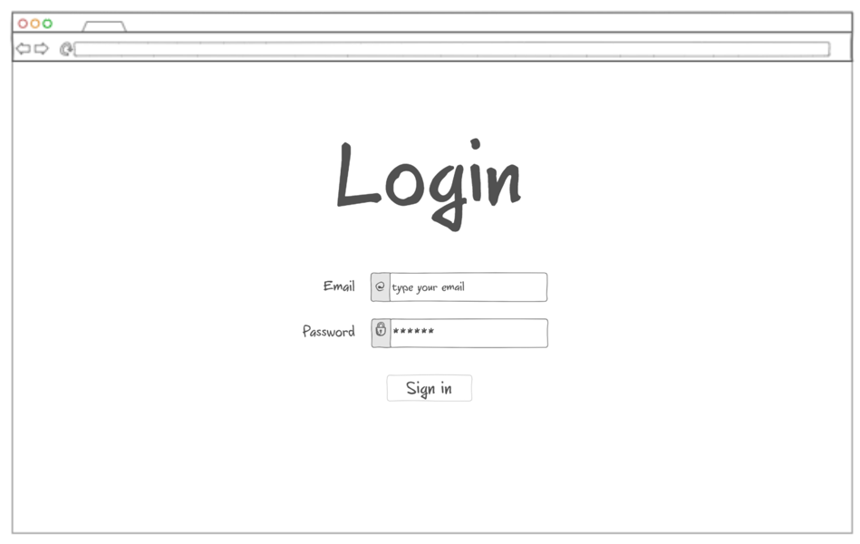

# RPG Collaborative Text Application

## Description deliverable

### Elevator pitch

The RPG Collaborative Text Application is a cooperative writing experience that takes inspiration from the gamebooks of the 80s and 90s (Choose Your Own Adventure, Lone Wolf, Fighting Fantasy, etc.). In such stories, the reader is an active participant who can make decisions that change the outcome of the story. In this application, users will all contribute to the same massive story, adding decisions and endings along the way. Anyone can create an account, add a new choice, and begin writing. Without the limitations of being a physical book, this application is free to grow and develop far beyond the scope of any of the gamebooks of old while encouraging creativity and cooperation.

### Design

Login Page

Reading Page

Story Addition Page

### Key features

- Ability to securely login
- Ability to read and play through the story so far
- Ablility to add choices, write new sections, and link up to existing portions of the story 
- Current story updated in realtime
- Current story and choice connections persistently stored
- Ability for admin to approve story additions, and delete undesired portions

### Technologies

Here are the technologies I will use with an explanation of how I will use them:

- **HTML** - Used in at least three pages, the login page, the story playthrough page, and the writing addition page. Hyperlinks will be used to jump to different sections of the story.
- **CSS** - Used to style the application to give it a modern look that dynamically adapts to different screen sizes.
- **JavaScript** - Used in login page and writing creation page to provide dynamic page elements.
- **Service** - Backend service with endpoints for:
  - login
  - retrieving story text and choice connections
  - adding new story text and choice connections
- **DB** - Stores users, story text, and chioce connections in the database.
- **Login** - Register and login users. Credentials securely stored in database. Can't contribute to the story unless authenticated.
- **WebSocket** - The story will update in real time as portions are written and will be made immediatly available to anyone playing through the story.

### HTML Deliverable
For this deliverable I built out the structure of my application using HTML.

- **HTML pages** - Three HTML pages (index.html, story.html, edit.html) that represent the ability to login, read the story, and edit or create new story pages
- **Links** - The login page automatically links to story reading page. The "+ Add Choice" button links to the story editing page.
- **Text** - The story and choices will be displayed through text.
- **3rd Pary Service** - On the story editing page, the buttons to save the text will call a service to save it to the database.
- **Images** - An image of a brave adventurer is displayed on the login page to excite and entice the user.
- **Login** - Input box and submit button for login.
- **Database** - The story and choices represent data pulled from the database.
- **WebSocket** - The count of total story pages and choices represent the tally of realtime data entries in the database.
